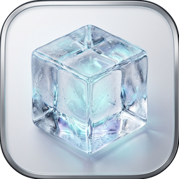

<div align="center">
    
    <h1>Ice Lite</h1>
    <p>A modernized, lightweight, and compact menu bar manager for macOS 14+</p>
    <p>
        <b>English</b> | <a href="README_ZH.md">简体中文</a>
    </p>
</div>

**Ice Lite** is a simplified, highly optimized, and visually modernized fork of the excellent open-source project [jordanbaird/Ice](https://github.com/jordanbaird/Ice). 

The goal of this fork is to create an extremely streamlined, single-purpose utility focused entirely on essential menu bar management, stripping away redundant modules and external dependencies while introducing a compact, premium native macOS visual language.

---

## ❄️ Key Differences & Technical Upgrades

* **Zero External Dependencies**: Fully removed the Sparkle auto-update framework and the Ifrit fuzzy search engine. The codebase is now 100% native Swift/SwiftUI with zero external packages, reducing compile time and lowering binary footprint.
* **Unified Preferences State**: Consolidated settings parameters from the redundant `AdvancedSettingsManager` directly into `GeneralSettingsManager`. Subscriptions and listeners to `UserDefaults` are now handled in a single unified preference manager, reducing reactive overhead.
* **Modern SwiftUI Windowing**: Upgraded `SettingsWindow` and `PermissionsWindow` scenes to utilize macOS 14+ native `.windowResizability(.contentSize)` and custom sizing specifications.
* **Pixel-Perfect Sidebar Layout**: Replaced generic `Label` sidebar cells with structured `HStack` views in `SettingsView` to bypass macOS list-style extraction, ensuring exact `16x16` icon sizing and alignment.
* **Async/Await Permission Workflow**: Refactored permission request checks to use Swift modern concurrency model (`async/await` and `CheckedContinuation`) instead of traditional GCD-based polling, making asynchronous state changes cleaner and thread-safe.
* **Modernized Aesthetics**: Replaced the bulky onboarding flow with a compact, card-based window (420px wide) featuring system materials, continuous squircle shapes, and custom status indicator pills.

---

## 🛠️ Features

### Menu Bar Item Management
- [x] Hide menu bar items
- [x] "Always-hidden" menu bar section
- [x] Show hidden menu bar items when hovering over the menu bar
- [x] Show hidden menu bar items when an empty area in the menu bar is clicked
- [x] Show hidden menu bar items by scrolling or swiping in the menu bar
- [x] Automatically rehide menu bar items
- [x] Drag and drop interface to arrange individual menu bar items
- [x] Display hidden menu bar items in a separate bar (e.g. for MacBooks with the notch)
- [x] Menu bar item spacing (BETA)

### Menu Bar Appearance
- [x] Menu bar tint (solid and gradient)
- [x] Menu bar shadow
- [x] Menu bar border
- [x] Custom menu bar shapes (rounded and/or split)

### Core Integration
- [x] Launch at login
- [x] Fully signed to run locally

---

## 🚀 How to Run Locally

### Requirements
* macOS 14.0 or later
* Xcode 15.0 or later

### Build & Run
1. Clone the repository:
   ```sh
   git clone https://github.com/elliclee/memubar-ice-lite.git
   cd memubar-ice-lite
   ```
2. Open `Ice.xcodeproj` in Xcode.
3. Select the **Ice** scheme and press `Cmd + R` to run, or compile a release version using:
   ```sh
   xcodebuild -scheme Ice -configuration Release -destination 'platform=macOS' -derivedDataPath ./build CODE_SIGN_IDENTITY="-" DEVELOPMENT_TEAM=""
   ```

---

## 📜 Acknowledgements & License

Ice Lite is based on [Ice](https://github.com/jordanbaird/Ice) created by Jordan Baird. We are incredibly grateful for their work.

Ice Lite is released under the **GPL-3.0 License** (same as the original upstream project). See [LICENSE](LICENSE) for details.
